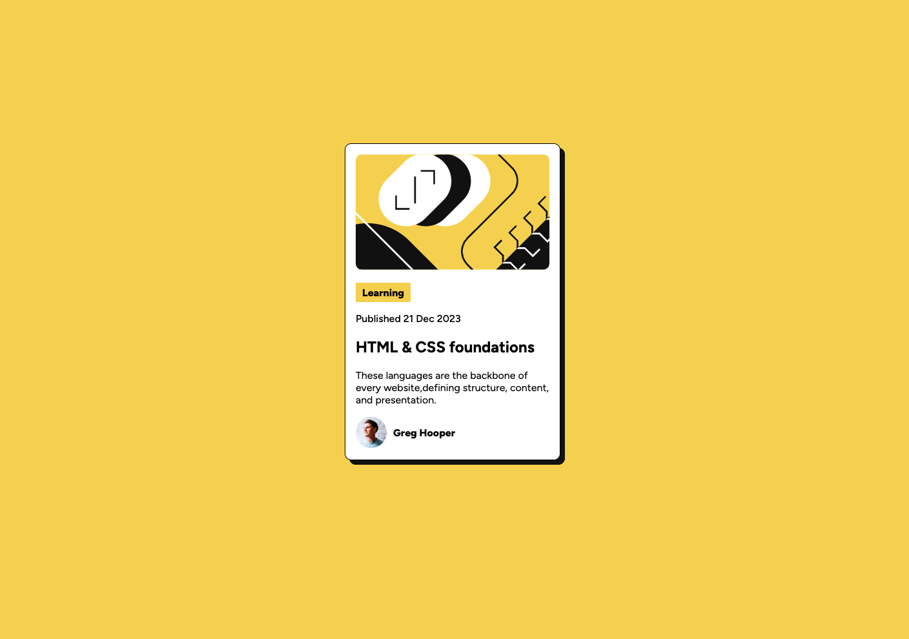

# Blog preview card solution

---

## Table of contents

- [Overview](#overview)
  - [Screenshot](#screenshot)
  - [Links](#links)

- [My process](#my-process)
  - [Built with](#built-with)
  - [What I learned](#what-i-learned)
  - [Useful resources](#useful-resources)
- [Acknowledgments](#acknowledgments)

## Overview

This project is about displaying a blog post preview card with details of the blog before a user would click on it.

### Screenshot

Desktop View

Mobile View

---

## My process

Approaching this project I confirmed how to place the elemnts in a grid. I use a small number of containers to ensure all the important details were included in the project. I also used Flex box within its own container to flex those properties.

### Built with

- Semantic HTML5 markup
- CSS custom properties
- CSS Grid
- Flexbox

### What I learned

Using a CSS Grid video gave great insight on how to implement grid in CSS.

### Useful resources

- [Youtube](https://youtu.be/JYfiaSKeYhE?si=Cp4MqeviUqKNlQTa) - This help me remember how to place items in a grid
- [W3schools CSS](https://www.w3schools.com/css/default.asp) - This is an amazing resource that help me remember the necessary properties I wanted to use in my stylesheet.
